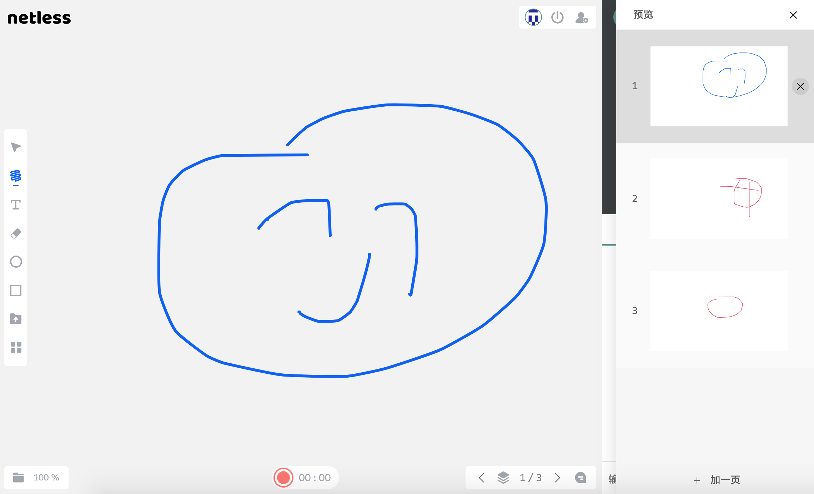

# 多页白板与场景管理

## 场景是什么（scene）



场景对终端客户来说就是上图 “白板” 以及 “白板分页”, 对开发者来说就是以下这种数据结构。

```typescript
type WhiteScene = {
    name: string; // 场景名称
    componentsCount: number; // 白板上的元素个数，新建的空场景就是 0
    ppt?: PptDescription; // ppt 的资源
};

type PptDescription = {
    src: string; // 动态 json , 静态 url
    width: number; // 文档宽
    height: number; // 文档高
};
```


